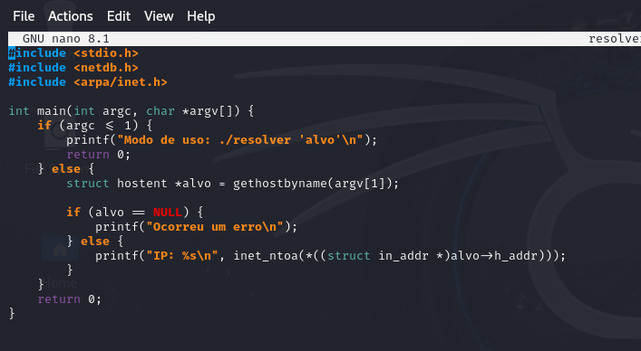
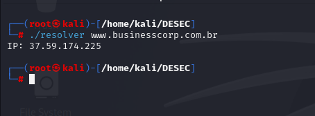

# Script em C, resolve o nome de um host para um endereço IP.

## Código

```c
#include <stdio.h>
#include <netdb.h>
#include <arpa/inet.h>

int main(int argc, char *argv[]) {
    if (argc <= 1) {
        printf("Modo de uso: ./resolver 'alvo'\n");
        return 0;
    } else {
        struct hostent *alvo = gethostbyname(argv[1]);

        if (alvo == NULL) {
            printf("Ocorreu um erro\n");
        } else {
            printf("IP: %s\n", inet_ntoa(*((struct in_addr *)alvo->h_addr)));
        }
    }
    return 0;
}



Saída:

